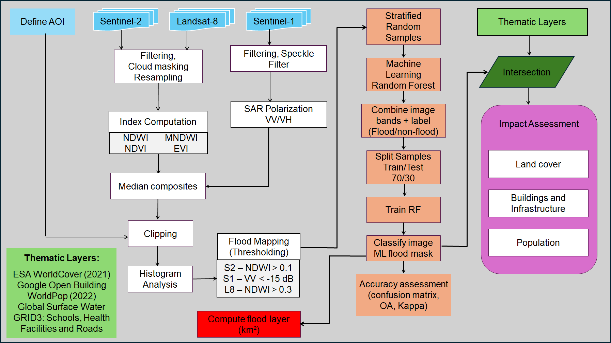
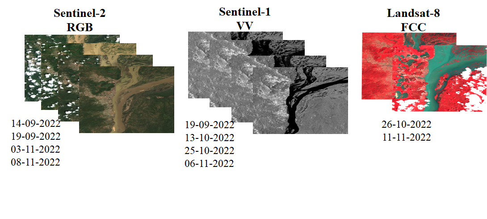

# Flood Impact Assessment on Infrastructure Along Niger - Benue River Confluence in Kogi State, Nigeria

This repository contains a complete **Google Earth Engine (GEE)** workflow to map flood extent and assess its impact on population, land cover, buildings, schools, and  health facilities. The analysis focuses on a flood event in Niger - Benue River Confluence in Kogi State, Nigeria (2022).

##  Overview

The project:
- Defines an Area of Interest (AOI) at the Niger‑Benue confluence, download and pre-process Sentinel‑1, Sentinel‑2, and Landsat‑8 imagery.
- Extracts flood masks via thresholding and Random Forest classification, then merge into a high‑confidence flood extent.
- Quantifies impacts on land cover, population, buildings and infrastructure

##  Requirements

Create a (virtual) python environment using Anaconda prompt

    conda create -n flood-mapping

flood-mapping is the name of the environment, then you have to activate your project with this command

    conda activate flood-mapping

install the libraries/dependencies, preferably using conda:

    conda install --file environment.yaml -c conda-forge -y

## Workflow

## Results
- Total flooded area - 140.9 km²
- Affected population - 34,551 people
- Buildings affected	- 9,844 out of 85,253
- Schools affected	- 6 out of 94
- Health facilities affected - 6 out of 84
- Roads flooded - 324 km out of 1,343 km

Land cover flooded (km²):
- Permanent water: 43.96
- Trees: 28.93
- Grassland: 22.06
- Cropland: 20.14
- Shrubland: 12.55
- Built‑up: 1.51

## How to Run the Notebook

- Clone this repository.
- Install the required libraries.
- Open notebook/main.ipynb in Jupyter / VS Code.
- Run cells sequentially (Buildings layer take time before downloading).
- The first run will ask you to authenticate Earth Engine (follow the link).
- All intermediate and final results are visualised inline.
- To export results to Google Drive, run the export cells.

## Repository Structure

Flood_Mapping/

├── images                  # images

├── notebook/

│   └── main.ipynb          # full analysis notebook

├── environment.yaml        # conda environment specification

└── README.md

## License

This project is open‑source (MIT). Data sources retain their own licences

## Contributors:

[Racheal Onocheta](https://github.com/RachelJoy92)

[Saheedat Ajike Akanbi](https://github.com/Holuwarkemmy)

[Idris Ibrahim](https://github.com/Abdallah2014)

[Lukumon Lateef (Mentor)](https://github.com/Surv-Lukmon)

## Data Source

Google Earth Engine team

ESA Copernicus Open Data

grid3

WorldPop

Google Open Building

ESA WorldCover

JRC Global Surface Water